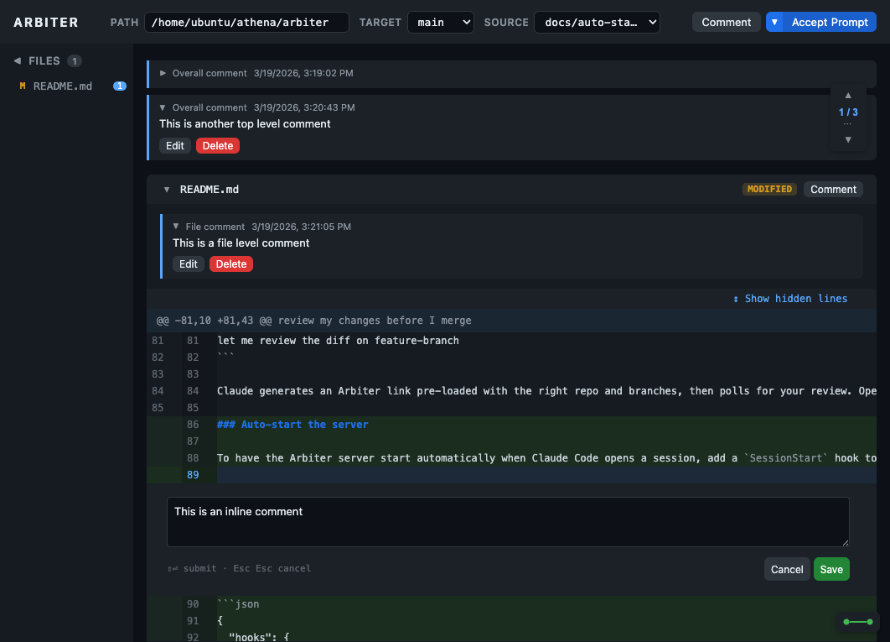

# Arbiter


Browser-based git diff reviewer with inline commenting and real-time agent integration. Review branch diffs GitHub-style, leave comments on specific lines or files, then export all comments as a structured markdown prompt for an AI agent to apply the fixes.



## Installation

```bash
git clone git@github.com:johnhof/arbiter.git
cd arbiter && npm install -g .
```

This installs `arbiter` as a global command. You can verify with `arbiter --help` or `which arbiter`.

## Usage

```bash
arbiter
```

Opens at `http://localhost:7429` (auto-increments if taken). Defaults to the git root of the current working directory.

### CLI Flags

| Flag | Description | Default |
|------|-------------|---------|
| `--path /path/to/repo` | Repository to diff | git root of CWD |
| `--port <number>` | Server port (auto-increments if taken) | `7429` |
| `--export <mode>` | Default export button: `clipboard`, `file`, or `accept` | `clipboard` |

## Features

- **Branch comparison** — select source and target branches from any local git repo
- **Unified diff view** — syntax-highlighted, with expandable hidden context lines
- **Three comment levels** — overall diff, per-file, and inline (line or range selection via click/shift-click/drag)
- **Comment navigation** — fixed widget with prev/next jumping and Clear All
- **Agent prompt export** — copy to clipboard, download as markdown, or accept for agent polling
- **Agent connection status** — live indicator showing whether an agent is listening
- **Generated file detection** — respects `.gitattributes` patterns to collapse generated/binary files

## Claude Code Skill

Arbiter ships with a Claude Code skill at `.claude/skills/arbiter/` that automates the review loop: Claude generates an Arbiter link, the user reviews and leaves comments, then clicks Accept. Claude polls for the prompt and applies the changes.

### Install the skill

**Option 1: Register the skill directory** in your Claude Code settings (`~/.claude/settings.json` for global, or `.claude/settings.json` for per-project):

```json
{
  "skills": ["<path-to-arbiter>/.claude/skills"]
}
```

**Option 2: Symlink** into a project's existing skills directory:

```bash
ln -s <path-to-arbiter>/.claude/skills/arbiter .claude/skills/arbiter
```

**Option 3: Copy** the skill directory into your project. Create `.claude/skills/arbiter/SKILL.md` with the contents from the Arbiter repo:

```
your-project/
└── .claude/
    └── skills/
        └── arbiter/
            └── SKILL.md    # Copy from <path-to-arbiter>/.claude/skills/arbiter/SKILL.md
```

Find your install path with `npm ls -g arbiter` or `which arbiter`.

### Use the skill

In Claude Code, invoke the skill with `/arbiter` or describe what you want:

```
/arbiter
review my changes before I merge
let me review the diff on feature-branch
```

Claude generates an Arbiter link pre-loaded with the right repo and branches, then polls for your review. Open the link, leave comments, click **Accept Prompt**, and Claude picks them up automatically.

### Auto-start the server

To have the Arbiter server start automatically when Claude Code opens a session, add a `SessionStart` hook to your project's `.claude/settings.json`:

```json
{
  "hooks": {
    "SessionStart": [
      {
        "hooks": [
          {
            "type": "command",
            "command": "arbiter",
            "async": true,
            "timeout": 10
          }
        ]
      }
    ]
  }
}
```

This runs `arbiter` in the background at session start. The server auto-detects the repo path and picks an available port (default 7429). Since `async` is true, it won't block Claude from starting.

If you need to pass flags (e.g., `--export accept`), use the full command:

```json
"command": "arbiter --export accept"
```

Arbiter must be installed globally (`npm install -g .`) for the hook to find it.

## Testing

```bash
npm test                                    # Run all tests
npm run test:ui                             # Interactive UI mode
npx playwright test tests/api.spec.js       # Specific file
npx playwright test -g "inline comment"     # By name
npx playwright test --headed                # Visible browser
```

Tests start their own server automatically — no manual setup needed.

## Architecture

Single-page app with no build step. Express backend wraps git CLI commands; vanilla JS frontend handles rendering and comment management. See [AGENTS.md](AGENTS.md) for the full design reference.
